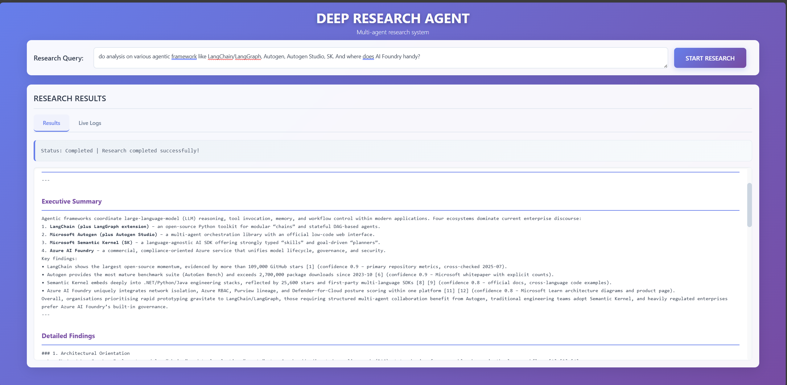

# 🔬 Deep Research Agents

AI agent system that automates internal document search and deep research for enterprises

## 🎯 Overview
Deep Research Agents is a next-generation MultiAgent system built on **Semantic Kernel**. Through **MagenticOrchestration**, multiple specialized AI agents dynamically collaborate to automatically generate high-quality research reports from enterprise internal documents. From internal document search via Azure AI Search, Semantic Kernel Memory, to comprehensive reliability assessment, it intelligently automates the entire enterprise research process.

### 🌟 Key Features

- **🤖 Magentic Multi-Agent Orchestration**: Latest orchestration technology from Semantic Kernel
- **🔍 Advanced Internal Document Search**: Azure AI Search + Semantic Kernel Memory integration
- **🌐 Web Search Integration**: Enhanced research capabilities with external web search fallback
- **🧠 Contextual Memory Management**: Persistent research context and knowledge integration via Semantic Kernel Memory
- **🛡️ AI Reliability Assessment**: Multi-layered Confidence evaluation and source quality management
- **📝 Structured Report Generation**: Evidence-based reports with citation management
- **🌐 Multilingual Intelligence**: Professional terminology translation system
- **⚡ Dynamic Quality Management**: Real-time quality assessment and self-improvement loops

## 🖥️ User Interface

The Deep Research Agent features an intuitive web interface that provides real-time research capabilities with professional styling and comprehensive result formatting.



**Interface Features:**
- **Clean, Professional Design**: Modern gradient interface with glass-morphism effects
- **Real-time Progress Tracking**: Live logs and status updates during research execution
- **Structured Results Display**: Well-formatted research reports with proper headings and citations
- **Tabbed Interface**: Separate views for results and live execution logs
- **Responsive Layout**: Works seamlessly across desktop and mobile devices
- **Interactive Research**: Simple query input with instant research initiation

## 🏗️ Architecture

Deep Research Agents is a next-generation MultiAgent system centered on **Microsoft Semantic Kernel** and **MagenticOrchestration**. It fully automates internal document search, analysis, and report generation specialized for enterprise R&D.

### 🎭 System Overview Diagram

```
                         ┌─────────────────────────────────┐
                         │    MagenticOrchestration        │
                         │  (StandardMagenticManager)      │
                         │     + R&D Logic Engine          │
                         └──────────┬──────────────────────┘
                                    │ Dynamic Coordination
                                    ▼
   ┌─────────────────────────────────────────────────────────────────┐
   │                     Specialized Agent System                    │
   │                    (Semantic Kernel Agents)                     │
   │                                                                 │
   │  ┌─────────────────┐ ┌─────────────────┐ ┌─────────────────┐    │
   │  │ LeadResearcher  │ │ Credibility     │ │   Summarizer    │    │
   │  │    Agent        │ │ Critic Agent    │ │     Agent       │    │
   │  │ ┌─────────────┐ │ │ (Source Quality │ │ (Knowledge      │    │
   │  │ │RESEARCHER1  │ │ │  Assessment)    │ │  Synthesis)     │    │
   │  │ │RESEARCHER2  │ │ │                 │ │                 │    │
   │  │ │RESEARCHER3+ │ │ │                 │ │                 │    │
   │  │ └─────────────┘ │ │                 │ │                 │    │
   │  └─────────────────┘ └─────────────────┘ └─────────────────┘    │
   │                                                                 │
   │  ┌─────────────────┐ ┌─────────────────┐ ┌─────────────────┐    │
   │  │ ReportWriter    │ │ Reflection      │ │  Translator     │    │
   │  │    Agent        │ │ Critic Agent    │ │    Agent        │    │
   │  │ (Confidence +   │ │ (Quality        │ │ (Professional   │    │
   │  │  Citations)     │ │  Validation)    │ │  Translation)   │    │
   │  └─────────────────┘ └─────────────────┘ └─────────────────┘    │
   │                                                                 │
   │  ┌─────────────────┐                                            │
   │  │  Citation       │                                            │
   │  │    Agent        │                                            │
   │  │ (Reference      │                                            │
   │  │  Management)    │                                            │
   │  └─────────────────┘                                            │
   └─────────────────────────────────────────────────────────────────┘
                                    │
                                    ▼
   ┌─────────────────────────────────────────────────────────────────┐
   │                     Plugin & Infrastructure Layer               │
   │                                                                 │
   │  ┌─────────────────┐ ┌─────────────────┐                        │
   │  │  Memory        │ │ ModularSearch   │                        │
   │  │   Plugin        │ │    Plugin       │                        │
   │  │ (Research       │ │ (Azure AI       │                        │
   │  │  Context)       │ │  Search)        │                        │
   │  └─────────────────┘ └─────────────────┘                        │
   └─────────────────────────────────────────────────────────────────┘
```

### 🔬 Internal Document Search System

**ModularSearchPlugin** provides comprehensive search capabilities:

An Azure AI Search integration system dynamically configured based on project settings (`config/project_config.yaml`). It provides unified interface search functionality across multiple indexes defined in configuration files.

The search system flexibly adapts to enterprise-specific document structures and index configurations, achieving high-precision information retrieval through a combination of Vector search, Semantic search, and Full-text search.

#### 🌐 Web Search Integration

**Enhanced Research Capabilities**: The system now includes web search functionality as an additional information source and fallback mechanism:

- **Primary Search**: Internal document search via Azure AI Search
- **Web Search Fallback**: When internal sources are insufficient, the system automatically falls back to web search
- **Configurable Integration**: Web search can be enabled/disabled and configured via `project_config.yaml`
- **Quality Assurance**: Web search results undergo the same reliability assessment as internal documents

<details>
<summary>

### 🎭 Specialized Agent Configuration

</summary>

#### 1. **LeadResearcherAgent** 🎯 *Lead Researcher*
   - **Role**: Manager and coordinator of multiple internal sub-ResearchAgents
   - **Architecture**: Contains and orchestrates 3+ sub-ResearchAgents (RESEARCHER1, RESEARCHER2, RESEARCHER3...)
   - **Special Capability**: Parallel orchestration and concurrent execution of multiple research queries
   - **Implementation**: Internal agent management via `ConcurrentOrchestration` and `ParallelResearchPlugin`
   - **Functions**: 
     - Distributes research queries across sub-ResearchAgents
     - Aggregates and synthesizes results from multiple agents
     - Quality management and result integration
     - Dynamic agent scaling based on workload
   - **Memory**: Context continuation through Semantic Kernel Memory integration shared across all sub-agents

#### 2. **CredibilityCriticAgent** 🔍 *Reliability Assessment Specialist*
   - **Role**: Scientific evaluation of internal source reliability and coverage
   - **Evaluation Criteria**: Source quality, information consistency, evidence strength
   - **Functions**: Supplementation through additional searches, reliability score calculation
   - **Output**: Structured reliability reports + improvement recommendations

#### 3. **SummarizerAgent** 📋 *Knowledge Integration Specialist*
   - **Role**: Structured summarization of large volumes of internal documents
   - **Specialization**: Classification by enterprise themes, prioritization
   - **Technology**: Hierarchical summarization, keyword extraction, relevance analysis
   - **Output**: Structured summaries + key point extraction

#### 4. **ReportWriterAgent** ✍️ *Report Generation Specialist*
   - **Role**: Final report creation and Confidence score assignment
   - **Technology**: Structured document generation, citation management, evidence demonstration
   - **Evaluation**: Multi-axis Confidence evaluation (source quality, consistency, comprehensiveness)
   - **Output**: Decision support reports + reliability indicators

#### 5. **ReflectionCriticAgent** 🎯 *Quality Assurance Specialist*
   - **Role**: Validation of report quality and Confidence evaluation validity
   - **Technology**: Meta-cognitive evaluation, logical consistency checks, improvement recommendations
   - **Standards**: Compliance with enterprise R&D quality standards
   - **Output**: Quality evaluation reports + improvement guidance

#### 6. **TranslatorAgent** 🌐 *Multilingual Specialist*
   - **Role**: High-precision translation with specialized terminology support
   - **Specialization**: Technical document format preservation, specialized terminology dictionary
   - **Functions**: Bidirectional Japanese-English translation, context-aware translation
   - **Quality**: Translation quality evaluation, terminology standardization

#### 7. **CitationAgent** 📚 *Citation Management Specialist*
   - **Role**: Internal document citation and reference management
   - **Technology**: Automated citation generation, source traceability
   - **Verification**: Citation accuracy, source existence confirmation
   - **Output**: Structured citation lists + metadata

</details>

## 🚀 Setup

### Prerequisites

Before using the Deep Research Agents, ensure you have the following:

- **Python 3.12+** (Recommended: 3.12.10 or later)
- **Azure OpenAI** account with access to:
  - GPT-4.1, GPT-4.1-mini, o3 or equivalent models
  - Text embedding models (text-embedding-3-small, text-embedding-3-large, etc.)
- **Azure AI Search** service with:
  - Semantic search configuration enabled
  - Vector search capabilities
  - Existing search indexes with your enterprise documents
- **Web Search API** (optional, for web search functionality):
  - Tavily API key
  - Currently, this repo only supports Tavily, please implement search providers if you want to use other search engines

### 📦 Installation

Follow these step-by-step instructions to set up the Deep Research Agents:

#### Step 1: Clone the Repository
```powershell
git clone <repository-url>
cd <directory-name>
```

#### Step 2: Create Python Virtual Environment (if needed)
```powershell
# Create virtual environment
python -m venv deepresearchagent

# Activate virtual environment
.\deepresearchagent\Scripts\Activate.ps1

# Verify activation (should show the virtual environment path)
where python
```

#### Step 3: Install Python Dependencies
```powershell
pip install -r requirements.txt
```

#### Step 4: Create Configuration Files from Templates

**4.1 Create Environment Variables File**
```powershell
# Copy template and create your .env file
Copy-Item .env.example .env
```
Please update based on your settings

**4.2 Create Project Configuration File**
```powershell
# Copy template and create your project configuration
Copy-Item config\project_config_templates.yaml config\project_config.yaml

```
Please update project configuration with your specific settings

**Required configurations in `config/project_config.yaml`:**
- Company information (system.company)
- **Azure AI Search index configurations (data_sources.document_types)**
- Web search settings (data_sources.web_search)
- Agent behavior parameters (agents)

#### Step 5: Launch the script
```powershell
# Start the research agent
python main.py --query "Could you summarize the latest update on Azure OpenAI in 2025?"
```

### 🛠️ Configuration Details

#### Template File Structure

The system uses template files that you need to copy and customize:

```
Deep-Research-Agents/
├── config/
│   ├── project_config_templates.yaml # Template for project configuration
│   └── project_config.yaml           # Your customized configuration (create this)
├── .env.example                      # Template for environment variables
└── .env                              # Your environment variables (create this)
```

## 🌐 Azure Deployment

### Prerequisites for Azure Deployment

Before deploying to Azure, ensure you have:

- **Azure CLI** installed and configured (`az --version`)
- **Azure Developer CLI** installed (`azd version`)
- **Active Azure subscription** with appropriate permissions
- **Python 3.12** runtime support in Azure App Service

### Step 1: Install Azure Tools
```powershell
# Install Azure CLI (if not already installed)
# Download from: https://docs.microsoft.com/en-us/cli/azure/install-azure-cli

# Install Azure Developer CLI
# Download from: https://docs.microsoft.com/en-us/azure/developer/azure-developer-cli/install-azd

# Verify installations
az --version
azd version
```

### Step 2: Azure Authentication
```powershell
# Login to Azure CLI
az login

# Login to Azure Developer CLI
azd auth login

# Set your subscription (if you have multiple)
az account set --subscription "YOUR-SUBSCRIPTION-ID"
```

### Step 3: Environment Configuration
Ensure your `.env` file contains all required Azure service endpoints:
```env
AZURE_OPENAI_ENDPOINT=https://your-openai.openai.azure.com/
AZURE_OPENAI_API_KEY=your-api-key
AZURE_OPENAI_DEPLOYMENT_NAME=gpt-4o
AZURE_OPENAI_API_VERSION=2024-02-15-preview
TAVILY_API_KEY=your-tavily-key
AZURE_SEARCH_ENDPOINT=https://your-search.search.windows.net
AZURE_SEARCH_KEY=your-search-key
```

### Step 4: Initialize Azure Project
```powershell
# Initialize the Azure project (first time only)
azd init

# Follow the prompts to:
# - Select Python as the language
# - Choose App Service as the hosting option
# - Set environment name (e.g., 'production', 'dev')
# - Select Azure region (e.g., 'East US', 'West Europe')
```

### Step 5: Deploy to Azure
```powershell
# Deploy infrastructure and application
azd up

# This command will:
# 1. Provision Azure resources (App Service, Resource Group)
# 2. Build the application
# 3. Deploy to Azure App Service
# 4. Configure environment variables
```

### Step 6: Update Deployment (After Changes)

For **quick application-only deployments** (recommended for code changes):
```powershell
# Deploy only application code (fastest option)
azd deploy --no-prompt

# This command will:
# 1. Package your application code
# 2. Upload to Azure App Service
# 3. Restart the application
# 4. Preserve existing infrastructure and settings
```

For **full infrastructure and application deployment**:
```powershell
# Full deployment with infrastructure updates
azd up --no-prompt

# Use this when you've changed:
# - Azure resource configurations
# - Environment variables
# - Infrastructure settings
```

### Step 7: Verify Deployment

After deployment, test your application:
```powershell
# Get the deployment URL
azd show

# Test the health endpoint
curl "https://[your-app-name].azurewebsites.net/health"

# Test the main interface
# Open https://[your-app-name].azurewebsites.net/ in your browser
```

## 🚀 Automated Deployment (Optional)

### GitHub Actions CI/CD Pipeline

The repository includes a GitHub Actions workflow (`.github/workflows/azure-dev.yml`) for automated deployments. This is **optional** but recommended for:

- **Automatic deployments** when code is pushed to main branch
- **Team collaboration** with consistent deployment process
- **Continuous integration** with automated testing

#### Setting Up GitHub Actions (Optional)

If you want automated deployments, configure these GitHub repository secrets:

1. **Repository Variables** (Settings → Secrets and variables → Actions → Variables):
   ```
   AZURE_CLIENT_ID: [your-service-principal-client-id]
   AZURE_TENANT_ID: [your-azure-tenant-id]
   AZURE_SUBSCRIPTION_ID: [your-azure-subscription-id]
   AZURE_ENV_NAME: [your-azd-environment-name]
   AZURE_LOCATION: [your-azure-region]
   ```

2. **Repository Secrets** (Settings → Secrets and variables → Actions → Secrets):
   ```
   AZURE_OPENAI_API_KEY: [your-azure-openai-key]
   AZURE_SEARCH_API_KEY: [your-azure-search-key]
   TAVILY_API_KEY: [your-tavily-api-key]
   ```

#### Manual vs Automated Deployment

**Manual Deployment (Current Method)**:
```powershell
azd deploy --no-prompt  # Fast, immediate control
```

**Automated Deployment (GitHub Actions)**:
- Triggers automatically on git push to main branch
- Includes automated health checks
- Consistent deployment process
- Requires initial setup of secrets/variables

**Recommendation**: Start with manual deployment, add GitHub Actions later for team environments.

#### Removing GitHub Actions (If Not Needed)

If you prefer manual deployment only, you can remove the workflow:
```powershell
# Remove the GitHub Actions workflow
Remove-Item -Path ".github\workflows\azure-dev.yml" -Force

# Or keep it for future use (recommended)
# The workflow won't run unless you configure the required secrets
```

### Troubleshooting Deployment Issues

#### Common Issues and Solutions

**1. Deployment Conflicts (409 Error)**
```powershell
# Stop all conflicting processes
Get-Process | Where-Object {$_.ProcessName -like "*azd*" -or $_.ProcessName -like "*azure*"} | Stop-Process -Force -ErrorAction SilentlyContinue

# Restart the web app
az webapp restart --name [YOUR-APP-NAME] --resource-group [YOUR-RG-NAME]

# Retry deployment
azd deploy --no-prompt
```

**2. Python Runtime Issues**
- Ensure `startup.txt` contains: `gunicorn app:app -w 1 -k uvicorn.workers.UvicornWorker --bind=0.0.0.0:$PORT --timeout 300`
- Verify Python 3.12 is specified in Azure configuration
- Check that all dependencies are in `requirements.txt`

**3. Environment Variable Issues**
```powershell
# Set environment variables manually if needed
az webapp config appsettings set --resource-group [RG-NAME] --name [APP-NAME] --settings AZURE_OPENAI_ENDPOINT="https://your-endpoint.openai.azure.com/"

# Check current settings
az webapp config appsettings list --resource-group [RG-NAME] --name [APP-NAME]
```

**4. Application Logs**
```powershell
# Stream live application logs
az webapp log tail --name [APP-NAME] --resource-group [RG-NAME]

# Download log files
az webapp log download --resource-group [RG-NAME] --name [APP-NAME]
```

### Production Deployment Checklist

- [ ] All environment variables configured
- [ ] Azure OpenAI endpoints accessible
- [ ] Azure AI Search indexes populated
- [ ] Web search API keys valid (if using web search)
- [ ] Application successfully starts
- [ ] Health check endpoint responds
- [ ] Research functionality tested end-to-end

### Accessing Your Deployed Application

After successful deployment, your application will be available at:
```
https://[your-app-name].azurewebsites.net/
```

The deployment process will display the URL in the terminal output.